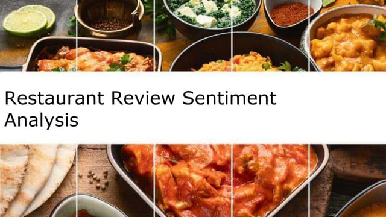

<h1 align="center">Restaurant Review Sentiment analysis with Keras ANN Using Deep Learning</h1>

## Overview
This project aims to perform sentiment analysis on restaurant reviews using a deep learning approach with Keras. The objective is to classify the sentiment polarity (positive or negative) expressed in the reviews accurately.
 

#### Project Description: 
1) Textual Data Processing Data Collection: 
   • Cleaned the text data by removing punctuation, converting text to lowercase, and removing stop words. 

   
2) Model Development Neural Network Architecture: 
   • Developed a simple Artificial Neural Network (ANN) model using Keras. 
   • The model consists of an input layer, one or more hidden layers with activation functions, and an output layer for binary classification. 
   • Compiled the model using the Adam optimizer and binary cross-entropy loss function, which are suitable for binary classification tasks. 

3) Model Training Data Splitting: 
   • Split the dataset into training and testing sets to evaluate the model's performance. 
   • Training: Trained the ANN model on the training data, adjusting the weights and biases through multiple epochs to minimize the loss and improve accuracy. 
   • Evaluation: Evaluated the model on the testing set, measuring accuracy, precision, recall, and F1-score to ensure reliable performance. 

#### Repository Contents 
• notebooks: Google Colab notebooks with detailed steps for data preprocessing, deep learning model development, training, and evaluation. 
• models: Saved model files for reuse and inference. 
• reports: Performance metrics and evaluation reports. 

